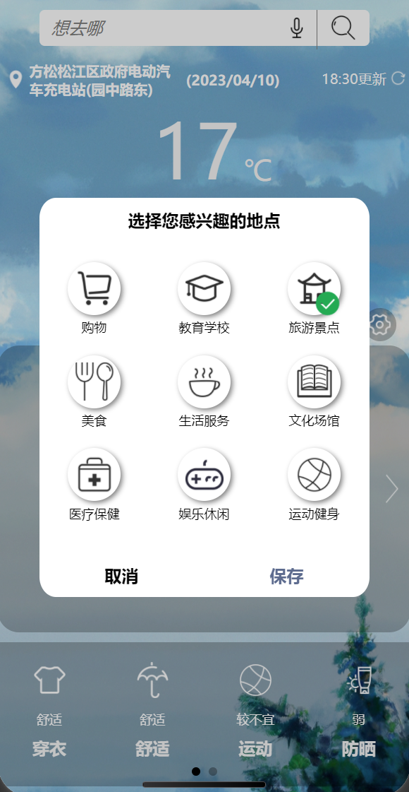
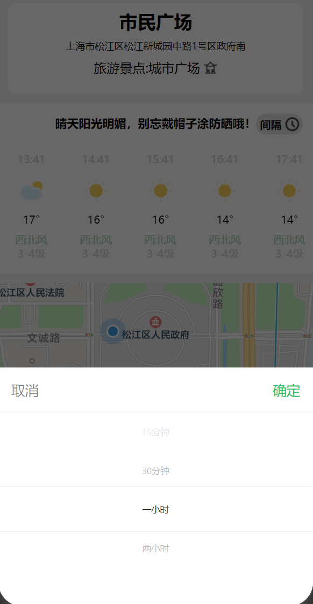

# JiKe Weather - Wechat Mini Program

## Introduction

JiKe Weather is a Wechat Mini Program designed to provide accurate fine-grained weather forecasting and travel assistance to users. With a focus on user interaction experience, JiKe Weather aims to enhance the convenience and effectiveness of accessing weather information for daily activities and travel planning.

## Features

- **Accurate Weather Forecasting**: Utilizes reliable data sources to provide precise weather forecasts for different locations.
- **Fine-Grained Forecast**: Offers detailed weather predictions including temperature, humidity, wind speed, and more for specific areas.
- **Travel Assistance**: Provides travel recommendations and suggestions based on weather conditions to assist users in planning their activities.
- **User-Friendly Interface**: Designed with an intuitive and visually appealing interface to enhance user experience.
- **Customizable Preferences**: Allows users to personalize settings and receive weather notifications according to their preferences.

## Significance

Weather forecasting plays a crucial role in various aspects of people's lives, including daily routines, outdoor activities, and transportation planning. By improving the accuracy of weather predictions and offering convenient access to weather information, JiKe Weather contributes to enhancing the quality of life for users and supporting the development of various economic sectors.

## Getting Started

To use JiKe Weather, simply search for "JiKe Weather" in the Wechat Mini Program directory and follow the instructions to install it on your device.

## Screenshots

    
    

    
    

    
    

## Contribution

Contributions to JiKe Weather are welcome! If you have any suggestions, bug reports, or feature requests, please feel free to open an issue or submit a pull request on GitHub.

## License

JiKe Weather is released under the MIT License. See the [LICENSE](LICENSE) file for details.
